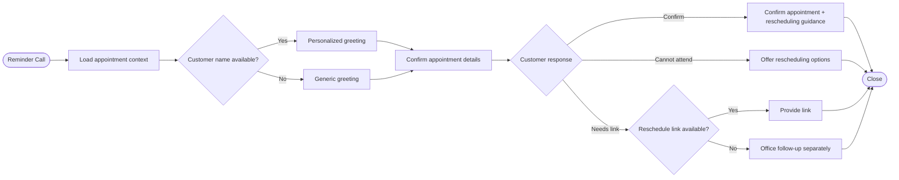

<div align="center">

# 🏠 BrightHome Reminder Agent

### Intelligent Appointment Reminder & Rescheduling Voice Agent

<p>
  <a href="https://www.loom.com/share/e0087aeb81e24d858820796eddb01578"></a>
  
  
  
  
</p>

<p><strong>Retell AI</strong> · <strong>Conversational AI</strong> · <strong>Appointment Reminders</strong> · <strong>Rescheduling</strong> · <strong>Graceful Fallbacks</strong></p>

</div>

---

## 🎯 Project Overview

**BrightHome Reminder Agent** is a Retell AI voice-agent assessment project for appointment confirmation and rescheduling support at BrightHome Cleaning Services.

The agent uses dynamic appointment context to personalize reminder conversations, confirm scheduled details, handle appointment declines, and gracefully continue when optional information is unavailable.

## 📊 Validation Snapshot

| Metric | Result |
|---|---:|
| Simulation scenarios | **4** |
| Passed | **4** |
| Failed | **0** |
| Pass rate | **100%** |
| Environment | **prod** |

## ✨ Core Capabilities

| Capability | Behavior |
|---|---|
| 👋 Personalized greeting | Uses customer context when available |
| 📅 Appointment confirmation | Confirms date, time, service, and address |
| 🔁 Rescheduling support | Provides the configured rescheduling path |
| 🙅 Decline handling | Acknowledges inability to attend and offers options |
| 🧩 Missing-name fallback | Uses a generic greeting instead of fabricating a name |
| 🔗 Missing-link fallback | Routes follow-up to the office instead of reading a blank link |
| 🛡️ Context-safe behavior | Does not invent missing dynamic data |
| ✅ Validation | 4/4 simulation scenarios passed |

## 🧠 Dynamic Variables

The agent uses these appointment-context variables:

```text
customer_name
appointment_date
appointment_time
service_type
service_address
reschedule_link
```

## 🔄 Conversation Flow



## 🧪 Assessment Test Suite — 4/4 Passed

| ID | Test Case | Validation Focus | Result |
|---:|---|---|:---:|
| **LEAD-201** | Happy Path | Confirms name, date, time, service, address, and reschedule link | ✅ Passed |
| **LEAD-202** | Decline Appointment | Politely handles inability to attend and offers rescheduling options | ✅ Passed |
| **LEAD-203** | Missing Name | Uses generic greeting without breaking | ✅ Passed |
| **LEAD-204** | Missing Link | Routes follow-up to office instead of reading a blank link | ✅ Passed |

### 🏆 Validation Result

<div align="center">

## 4 / 4 — PASSED
### 100% Simulation Pass Rate

</div>

## 🔍 Scenario Details

### LEAD-201 · Happy Path
Confirms the customer and the scheduled appointment context, including date, time, service type, and service address, then provides the rescheduling path.

### LEAD-202 · Decline Appointment
Acknowledges the customer's inability to attend politely and offers rescheduling options.

### LEAD-203 · Missing Name
Falls back to a generic greeting such as **“Hi there”** when the customer name is unavailable.

### LEAD-204 · Missing Link
Does not attempt to read a blank reschedule link; instead, it states that the office will follow up separately.

## 🛡️ Reliability Principles

- Never fabricate customer or appointment data.
- Gracefully handle missing dynamic values.
- Keep rescheduling guidance safe when the link is unavailable.
- Maintain clear, professional conversational closure.

## 🧰 Technology Stack

| Technology | Purpose |
|---|---|
| **Retell AI** | Voice-agent platform |
| **Conversational LLM** | Natural dialogue and reasoning |
| **Dynamic Variables** | Appointment-specific personalization |
| **Simulation Testing** | Behavioral validation |
| **Voice Interface** | Caller interaction |

## 📁 Repository Structure

```text
brighthome-reminder-agent/
│
├── 📄 README.md
├── 📄 BrightHome_Reminder_Agent_Assessment_Report.pdf
├── 📄 test-cases-agent_1c0502f928da580811150ee028.json
│
└── 📁 docs/
    ├── ARCHITECTURE.md
    └── TEST-RESULTS.md
```

## 🎥 Demo & Evidence

### ▶️ Loom Walkthrough
**[Watch the BrightHome Reminder Agent demo →](https://www.loom.com/share/e0087aeb81e24d858820796eddb01578)**

### 📄 Assessment Report
**[Open the assessment report →](BrightHome_Reminder_Agent_Assessment_Report.pdf)**

### 🧪 Test Configuration
**[View the complete test-case JSON →](test-cases-agent_1c0502f928da580811150ee028.json)**

## 📚 Documentation

- [Architecture](docs/ARCHITECTURE.md)
- [Test Results](docs/TEST-RESULTS.md)
- [Assessment Report](BrightHome_Reminder_Agent_Assessment_Report.pdf)
- [Test Configuration](test-cases-agent_1c0502f928da580811150ee028.json)

## 📈 What This Project Demonstrates

This assessment demonstrates practical skills in:

- Voice-agent conversation design
- Dynamic-variable driven personalization
- Appointment reminder workflows
- Rescheduling logic
- Missing-data fallback design
- Conversational resilience
- Simulation-based testing
- Technical documentation

## 🚀 Future Enhancements

- Calendar availability integration
- Automated rescheduling actions
- CRM synchronization
- SMS/email reminder workflows
- Post-call analytics
- Human escalation for complex requests

These are future enhancements, not claims of current implementation.

## 👤 Author

<div align="center">

### Shaik Mohammad Shaheed

**AI & Automation · AI Agents · Generative AI · API Integration · Workflow Automation**

<a href="https://github.com/shaikshahid777">GitHub Profile</a>

</div>

---

<div align="center">

### ⭐ BrightHome Reminder Agent

**Reliable conversational AI for appointment reminder and rescheduling workflows.**

<sub>Educational assessment / portfolio project.</sub>

</div>